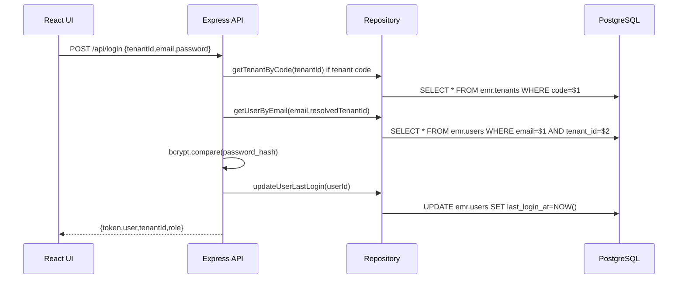
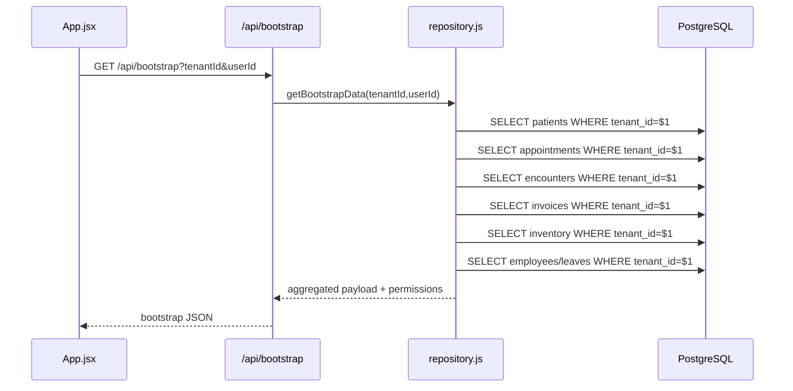
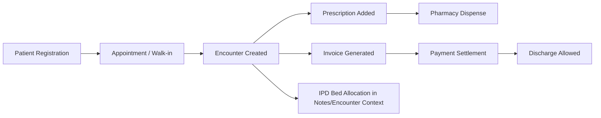
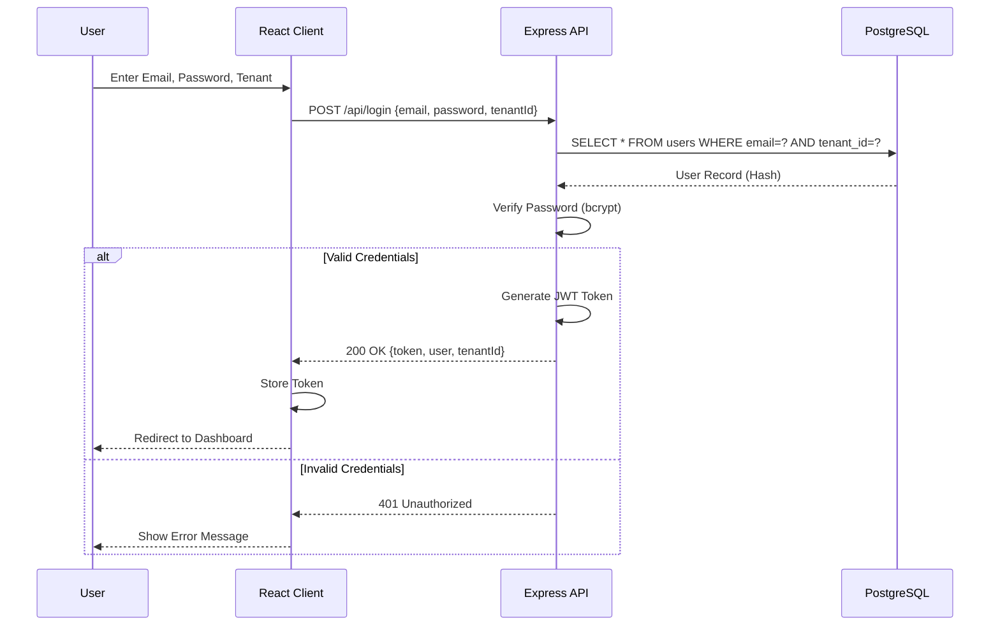
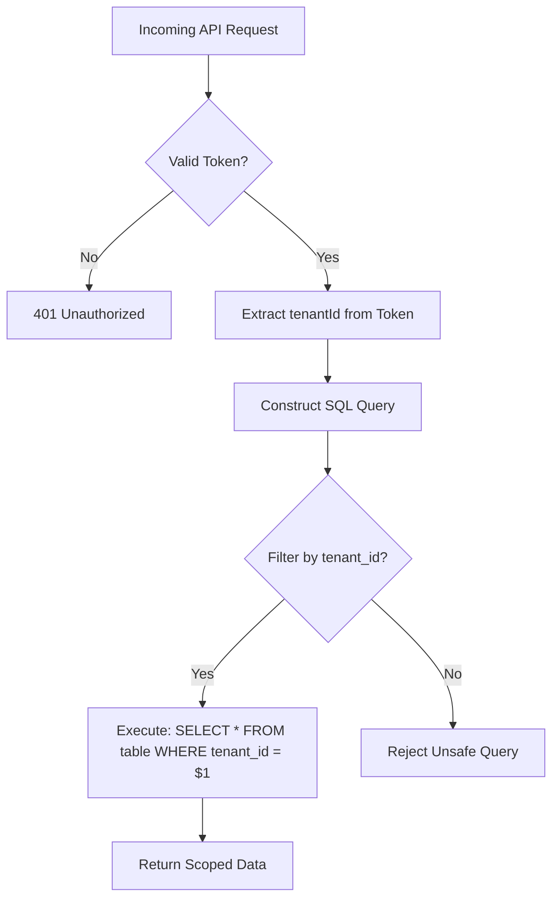

# Technical Design & Architecture - MedFlow EMR

## 1. Architectural Philosophy
The MedFlow EMR follows a **Multi-Tenant SaaS** architecture utilizing a **Single-Page Application (SPA)** frontend and a **Stateless REST API** backend.

### 1.1 Core Principles
- **Tenant Isolation**: Mandatory `tenant_id` scoping at the Repository layer.
- **Unified State**: Top-down data flow managed in `App.jsx`.
- **Defensive UI**: Safe API parsing and robust fallbacks for all clinical data points.

---

## 2. Technology Stack

### 2.1 Frontend
- **Framework**: React 18 (Vite)
- **Styling**: Vanilla CSS + **Premium Glassmorphism Layer**.
- **Icons**: Optimized inline SVG iconography.
- **State**: React Hook based internal state (No external Redux).

### 2.2 Backend
- **Runtime**: Node.js (Express.js)
- **Security**: BCryptJS, JSON Web Tokens (JWT), Helmet, CORS.
- **Database**: PostgreSQL (Managed).

---

## 3. Low-Level Design

## 3.1 Runtime Layers
1. Presentation Layer (React):
   - Entry and orchestrator: `client/src/App.jsx`
   - Shell/navigation: `client/src/components/AppLayout.jsx`
   - Feature pages: `client/src/pages/*`
   - API adapter: `client/src/api.js`
2. API Layer (Express):
   - Entry/router: `server/index.js`
   - Auth and tenant guards: `server/middleware/auth.middleware.js`
   - Feature/module gates: `server/middleware/featureFlag.middleware.js`
3. Data Access Layer:
   - Primary repository: `server/db/repository.js`
   - Financial repository helpers: `server/db/repo_financials.js`
   - Connection pool: `server/db/connection.js`
4. Data Layer:
   - PostgreSQL shared schema (`emr.*`)
   - Isolation boundary enforced through `tenant_id` filtering.

## 3.2 Frontend Interaction Model
1. User logs in from `LoginPage`.
2. `api.login()` stores JWT + user + tenant context.
3. `App.jsx` triggers `refreshTenantData()`:
   - `/bootstrap`
   - `/users`
   - `/reports/summary` (role-permission dependent)
4. Module page operations call `api.js` functions.
5. Responses update top-level state in `App.jsx` and are propagated via props.

## 3.3 Backend Request Pipeline
1. Request enters Express route in `server/index.js`.
2. `authenticate` validates JWT and hydrates `req.user`.
3. `requireTenant` validates tenant context (`x-tenant-id` or query/body).
4. `requirePermission` enforces role authorization per module.
5. Route handler calls repository function(s).
6. Repository executes parameterized SQL.
7. Response serialized to JSON.
8. Errors are normalized by global error handler.

## 3.4 Role-Permission Engine (Low-Level)
- Permission map defined in: `server/middleware/auth.middleware.js` (`PERMISSIONS`).
- UI fallback map defined in: `client/src/config/modules.js` (`fallbackPermissions`).
- Runtime behavior:
  - Backend map is source of truth for API access.
  - Frontend map drives navigation visibility fallback.
  - `bootstrap.permissions` can override defaults for UI rendering.

---

## 4. Database Design and Flow

## 4.1 Core Tables (Operational)
- `emr.tenants`: tenant metadata, feature flags, theme.
- `emr.users`: identity, role, tenant association.
- `emr.patients`: demographics and profile.
- `emr.walkins`: reception queue.
- `emr.appointments`: scheduled interactions.
- `emr.encounters`: clinical sessions (OPD/IPD/Emergency).
- `emr.clinical_records`: journal entries and diagnostics.
- `emr.prescriptions`: medication orders.
- `emr.inventory_items`: stock and reorder thresholds.
- `emr.invoices`: billing and payment status.
- `emr.expenses`: accounts payable ledger.
- `emr.insurance_providers` / `emr.claims`: payer workflows.
- `emr.employees`, `emr.attendance`, `emr.employee_leaves`: HR operations.
- `emr.audit_logs`: traceability and governance.

## 4.2 Mandatory Data Guardrails
1. Tenant isolation:
   - Every tenant-scoped query includes `WHERE tenant_id = $1`.
2. SQL safety:
   - Parameterized queries only (`$1`, `$2`, ...).
3. Role integrity:
   - Role check constraint on `emr.users.role` (`users_role_check`).
4. Auth integrity:
   - Password hashes with bcrypt; JWT for stateless session context.

## 4.3 Database Flow - Authentication

## 4.4 Database Flow - Tenant Bootstrap

## 4.5 Database Flow - Clinical to Settlement

## 4.6 Database Flow - Reporting
1. `GET /api/reports/summary`:
   - Aggregates appointments, open queues, lab metrics, pending invoices.
2. `GET /api/reports/financials`:
   - Month-scoped revenue/expense/tax summary.
3. `GET /api/reports/payouts`:
   - Provider-wise encounter/revenue/commission rollups.
4. Dashboard consumption:
   - Dashboard consumes report summary for KPI cards/charts.
   - Reports page consumes summary + payouts for strategic analytics.

---

## 5. Data Flow Diagrams

### 5.1 Authentication Sequence

### 5.2 Tenant Isolation Flow

---

## 6. Premium Design System (v2.0)

### 4.1 Visual Tokens
- **Glass Panel**: `rgba(255, 255, 255, 0.8)` with `backdrop-filter: blur(20px)`.
- **Dynamic Variable Injection**: Root-level `--tenant-primary` and `--tenant-accent` variables.

### 4.2 UI Components
- **Clinical Sidebar**: Translucent, contextual-aware search and subject cards.
- **Workspace Header**: Tabbed navigation with active indicator glow.
- **Stock Meters**: Horizontal progress indicators with semantic colors (Red/Amber/Green).

---

## 7. Implementation Guide

### 5.1 Repository Pattern
- All database queries reside in `server/db/repository.js`.
- **STRICT RULE**: Every function must accept and enforce `tenant_id`.

### 5.2 Common Workflows
- **Adding a Module**:
  1. Define metadata in `config/modules.js`.
  2. Implement Page in `pages/` using `.premium-glass` panels.
  3. Register view logic in `App.jsx`.
